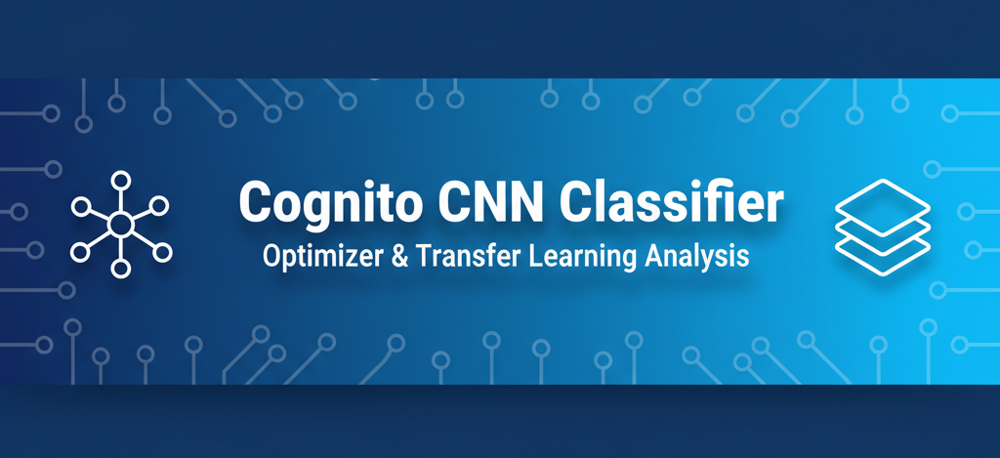
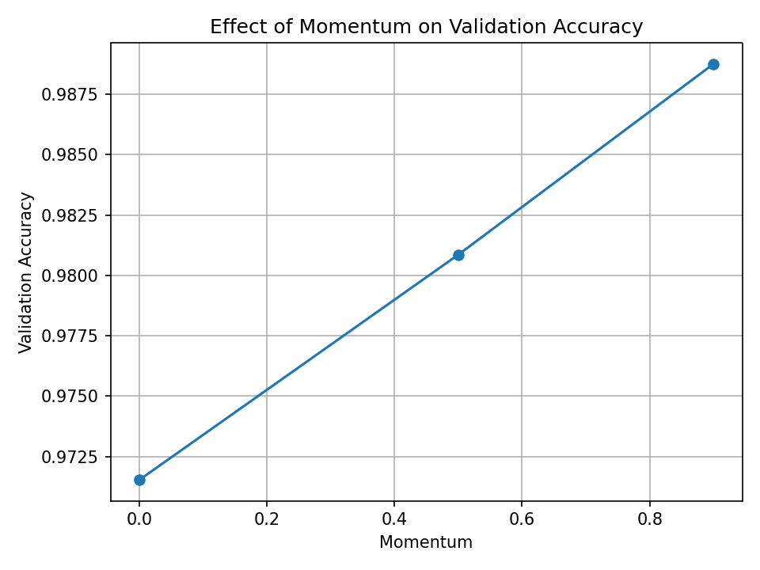
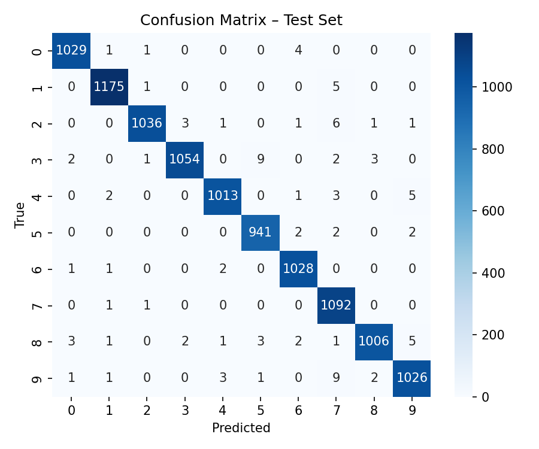
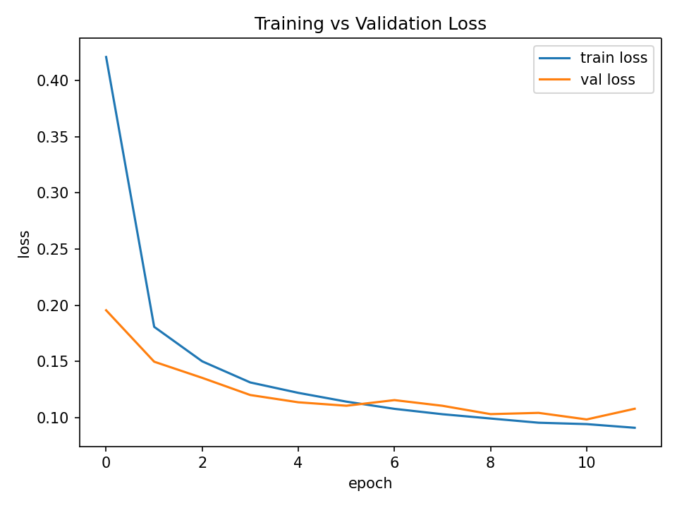
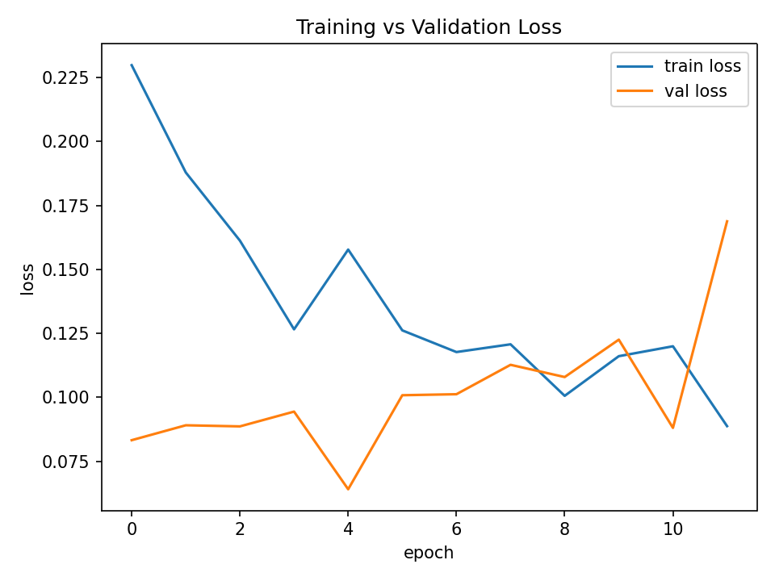

#CNN Image Classifier

<p align="center">
  
</p>

<h1 align="center">🧠 CNN Digit Classifier — Optimizer & Transfer Learning Analysis</h1>

<p align="center">
  <b>EN3150 - Pattern Recognition | Department of Electrical Engineering | University of Moratuwa</b><br>
  Exploring optimizer dynamics and transfer learning on MNIST (UCI ID 683)
</p>

---
<p align="center">
  <a href="https://pytorch.org/"></a>
  <a href="LICENSE"></a>
  <a href="#"></a>
</p>

---

## Overview

This work was developed as part of **EN3150 – Pattern Recognition (Assignment 03)**,  
Department of Electrical Engineering, **University of Moratuwa**.

The key objectives are:
- Build and train a CNN for MNIST classification.
- Compare three optimizers: `Adam`, `SGD`, and `SGD + Momentum`.
- Study how momentum influences convergence.
- Evaluate performance using accuracy, precision, recall, and confusion matrices.
- Fine-tune pretrained models (**ResNet18**, **VGG16**) and compare with the baseline CNN.

---

## 🏗️ Project Structure

```bash
cognito-cnn-image-classifier/
│
├── data/
│   ├── MNIST/                # Dataset storage
│   └── splits/               # Train/val/test index files
│
├── models/
│   ├── cnn.py                # Baseline CNN architecture
│   └── transfer_models.py    # Pretrained ResNet18 & VGG16 models
│
├── utils/
│   ├── dataset_loader.py     # Dataset loading & transforms
│   ├── train_utils.py        # Training loops & schedulers
│   ├── metrics_utils.py      # Evaluation metrics & confusion matrices
│   ├── momentum_sweep.py     # Momentum parameter sweep
│   └── plot_utils.py         # Plot training curves
│
├── reports/
│   ├── figures/              # PNG plots, confusion matrices, checkpoints
│   └── results.csv           # Logged accuracy/precision/recall
│
├── main.py                   # Baseline CNN training entry point
├── main_transfer.py          # Transfer-learning experiments
├── requirements.txt
├── LICENSE
└── README.md
```
## ⚙️ Setup

### 1️⃣ Clone the repository
```bash
git clone https://github.com/pramodyasahan/cognito-cnn-image-classifier.git
cd cognito-cnn-image-classifier
```

2️⃣ Create environment
```bash
python3 -m venv venv
source venv/bin/activate
pip install -r requirements.txt
```

3️⃣ Download dataset

MNIST will automatically download from the UCI Machine Learning Repository via `torchvision.datasets.MNIST().`

## 🧪 Training & Evaluation
### 🔹 Baseline CNN (Optimizer Comparison)
```bash
python main_baseline.py
```
- Trains CNN with Adam, SGD, and SGD + Momentum
- Saves confusion matrices and loss curves under `reports/figures/`

### 🔹 Transfer Learning (ResNet18 & VGG16)
```bash
python main_transfer.py
```
- Loads pretrained models
- Freezes early layers, fine-tunes final classifier
- Saves metrics and confusion matrices

### 📊 Results Summary

| **Model**              | **Optimizer**        | **Epochs** | **Train Acc.** | **Val Acc.** | **Test Acc.** | **Precision (macro)** | **Recall (macro)** |
|--------------------------|----------------------|-------------|----------------|---------------|----------------|------------------------|--------------------|
| Custom CNN               | Adam                 | 20          | 0.9910         | 0.9919        | 0.9919         | 0.9918                 | 0.9919             |
| Custom CNN               | SGD                  | 20          | 0.9820         | 0.9856        | 0.9856         | 0.9856                 | 0.9856             |
| Custom CNN               | SGD + Momentum (0.9) | 20          | 0.9920         | **0.9922**    | **0.9922**     | **0.9921**             | **0.9922**         |
| ResNet18 (Transfer)      | Adam (fine-tune)     | 12          | 0.9717         | 0.9653        | 0.9687         | 0.9683                 | 0.9684             |
| VGG16 (Transfer)         | Adam (fine-tune)     | 12          | **0.9910**     | **0.9899**    | **0.9905**     | **0.9905**             | **0.9904**         |

> 🧩 **Highlights:**
> - Momentum improved SGD’s performance, nearly matching Adam.
> - **VGG16 (transfer-learning)** achieved the highest precision and recall.
> - All models exceeded 96 % test accuracy — confirming strong generalization.
>

---

### 📈 Visual Results

Below are sample outputs from the experiments, including the **momentum sweep**, **confusion matrices**, and **loss curves** for both pretrained models.

<p align="center">
  
  
</p>

<p align="center">
  
  
</p>

---

### 🧠 Key Insights

- **Momentum** improves the stability of gradient descent and helps SGD approach Adam’s performance.
- The **custom CNN** remains lightweight and efficient while maintaining competitive accuracy.
- **Transfer learning** with pretrained **VGG16** achieved the best precision and recall overall.
- **ResNet18** performed well but required more compute time due to deeper residual blocks.
- All models generalized well, achieving over **96 % test accuracy** on MNIST.

---

### ⚙️ Reproducibility

To reproduce these experiments:

1. Clone this repository and install dependencies.
2. Run `python main_baseline.py` to train the custom CNN with all optimizers.
3. Run `python main_transfer.py` to train and evaluate ResNet18 and VGG16.
4. All outputs (figures, logs, metrics CSV) will be saved under `reports/`.


---

<p align="center">
  <sub>© 2025 Team Cognito · Department of Electrical Engineering, University of Moratuwa</sub>
</p>
