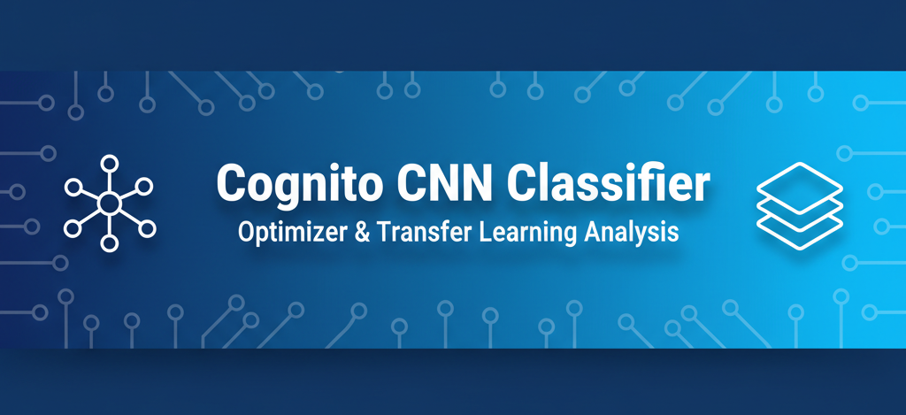
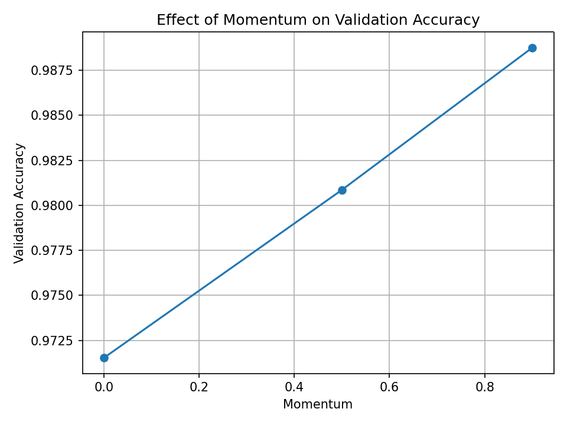
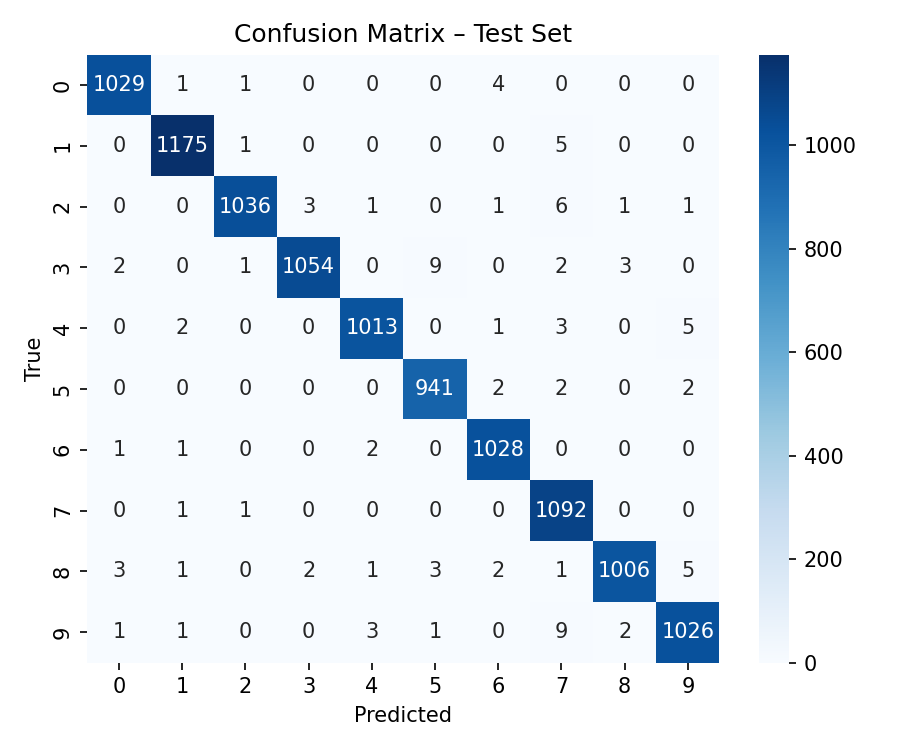
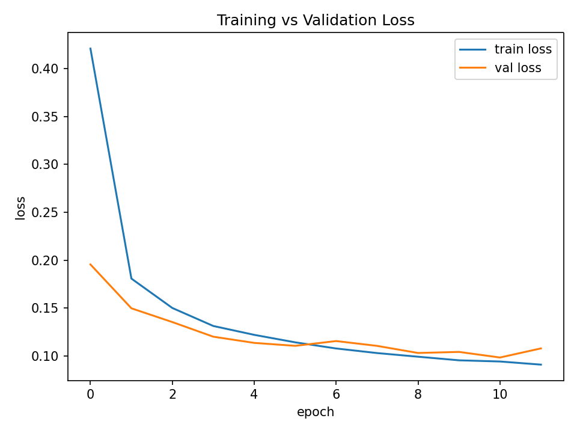
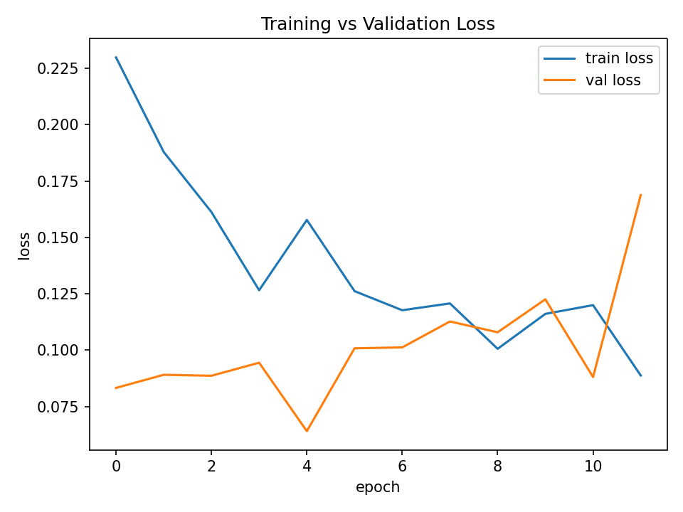

#CNN Image Classifier

<p align="center">
  
</p>

<h1 align="center">🧠 CNN Digit Classifier — Optimizer & Transfer Learning Analysis</h1>

<p align="center">
  <b>EN3150 - Pattern Recognition | Department of Electrical Engineering | University of Moratuwa</b><br>
  Exploring optimizer dynamics and transfer learning on MNIST (UCI ID 683)
</p>

---
<p align="center">
  <a href="https://pytorch.org/"></a>
  <a href="LICENSE"></a>
  <a href="#"></a>
</p>

---

## Overview

This work was developed as part of **EN3150 – Pattern Recognition (Assignment 03)**,  
Department of Electrical Engineering, **University of Moratuwa**.

The key objectives are:
- Build and train a CNN for MNIST classification.
- Compare three optimizers: `Adam`, `SGD`, and `SGD + Momentum`.
- Study how momentum influences convergence.
- Evaluate performance using accuracy, precision, recall, and confusion matrices.
- Fine-tune pretrained models (**ResNet18**, **VGG16**) and compare with the baseline CNN.

---

## 🏗️ Project Structure

```bash
cognito-cnn-image-classifier/
│
├── data/
│   ├── MNIST/                # Dataset storage
│   └── splits/               # Train/val/test index files
│
├── models/
│   ├── cnn.py                # Baseline CNN architecture
│   └── transfer_models.py    # Pretrained ResNet18 & VGG16 models
│
├── utils/
│   ├── dataset_loader.py     # Dataset loading & transforms
│   ├── train_utils.py        # Training loops & schedulers
│   ├── metrics_utils.py      # Evaluation metrics & confusion matrices
│   ├── momentum_sweep.py     # Momentum parameter sweep
│   └── plot_utils.py         # Plot training curves
│
├── reports/
│   ├── figures/              # PNG plots, confusion matrices, checkpoints
│   └── results.csv           # Logged accuracy/precision/recall
│
├── main.py                   # Baseline CNN training entry point
├── main_transfer.py          # Transfer-learning experiments
├── requirements.txt
├── LICENSE
└── README.md
```
## ⚙️ Setup

### 1️⃣ Clone the repository
```bash
git clone https://github.com/pramodyasahan/cognito-cnn-image-classifier.git
cd cognito-cnn-image-classifier
```

2️⃣ Create environment
```bash
python3 -m venv venv
source venv/bin/activate
pip install -r requirements.txt
```

3️⃣ Download dataset

MNIST will automatically download from the UCI Machine Learning Repository via `torchvision.datasets.MNIST().`

## 🧪 Training & Evaluation
### 🔹 Baseline CNN (Optimizer Comparison)
```bash
python main_baseline.py
```
- Trains CNN with Adam, SGD, and SGD + Momentum
- Saves confusion matrices and loss curves under `reports/figures/`

### 🔹 Transfer Learning (ResNet18 & VGG16)
```bash
python main_transfer.py
```
- Loads pretrained models
- Freezes early layers, fine-tunes final classifier
- Saves metrics and confusion matrices

### 📊 Results Summary

| **Model**              | **Optimizer**        | **Epochs** | **Train Acc.** | **Val Acc.** | **Test Acc.** | **Precision (macro)** | **Recall (macro)** |
|--------------------------|----------------------|-------------|----------------|---------------|----------------|------------------------|--------------------|
| Custom CNN               | Adam                 | 20          | 0.9910         | 0.9919        | 0.9919         | 0.9918                 | 0.9919             |
| Custom CNN               | SGD                  | 20          | 0.9820         | 0.9856        | 0.9856         | 0.9856                 | 0.9856             |
| Custom CNN               | SGD + Momentum (0.9) | 20          | 0.9920         | **0.9922**    | **0.9922**     | **0.9921**             | **0.9922**         |
| ResNet18 (Transfer)      | Adam (fine-tune)     | 12          | 0.9717         | 0.9653        | 0.9687         | 0.9683                 | 0.9684             |
| VGG16 (Transfer)         | Adam (fine-tune)     | 12          | **0.9910**     | **0.9899**    | **0.9905**     | **0.9905**             | **0.9904**         |

> 🧩 **Highlights:**
> - Momentum improved SGD’s performance, nearly matching Adam.
> - **VGG16 (transfer-learning)** achieved the highest precision and recall.
> - All models exceeded 96 % test accuracy — confirming strong generalization.
>

---

### 📈 Visual Results

Below are sample outputs from the experiments, including the **momentum sweep**, **confusion matrices**, and **loss curves** for both pretrained models.

<p align="center">
  
  
</p>

<p align="center">
  
  
</p>

---

### 🧠 Key Insights

- **Momentum** improves the stability of gradient descent and helps SGD approach Adam’s performance.
- The **custom CNN** remains lightweight and efficient while maintaining competitive accuracy.
- **Transfer learning** with pretrained **VGG16** achieved the best precision and recall overall.
- **ResNet18** performed well but required more compute time due to deeper residual blocks.
- All models generalized well, achieving over **96 % test accuracy** on MNIST.

---

### ⚙️ Reproducibility

To reproduce these experiments:

1. Clone this repository and install dependencies.
2. Run `python main_baseline.py` to train the custom CNN with all optimizers.
3. Run `python main_transfer.py` to train and evaluate ResNet18 and VGG16.
4. All outputs (figures, logs, metrics CSV) will be saved under `reports/`.


---

### ! Contribution

1. Overview of how we organized work

Individual development — each member implemented and ran a separate part of the assignment in their own branch:
Part A: baseline CNN design, training runs and optimizer/momentum experiments.
Part B: transfer-learning experiments (two separate pretrained backbones, each fine-tuned independently).
Code quality & report: overall code review, error handling, reproducibility, and report assembly.

Cross-check & integration — after finishing individual tasks we performed peer code reviews, harmonised data splits and preprocessing, re-ran chosen experiments with the agreed environment, and then built the final combined models (final fine-tuning, selection of best hyperparameters and ensembling where appropriate). This two-stage workflow (individual → team integration) ensured both independence of experiments and a robust final outcome. Evidence and details for all experiments and the integration process are in the project report

2. Individual contributions 

Member 1 — Ishan W. A. (220241K) — Baseline model training & experiments (Lead: Part A)
• Implemented and trained the baseline CNN (models/cnn.py) used as the control model for comparisons.
• Ran optimizer experiments (Adam, SGD, SGD+Momentum) and the momentum-sweep (0.0, 0.5, 0.9) and produced the training/validation curves and metric logs.
• Produced the baseline results CSV, epoch-wise logs and the confusion matrices used in Section 4 of the report.
• Files / scripts produced: main.py, momentum_sweep.py, train_utils.py (training loop), reports/customcnn_*.pt (checkpoints).
• Contribution notes: Responsible for experimental design and hyperparameter sweeps related to the baseline. 

Yourgroupno_A03_EN3150

Member 2 — Ridmika K. H. (220535P) — Transfer learning: ResNet finetune & experiments (Lead: ResNet finetuning in Part B)
• Took responsibility for transfer-learning with ResNet18: building the factory, freezing backbone, replacing heads and fine-tuning on MNIST (resized to 224×224×3).
• Tuned learning rate, ran 12-epoch fine-tune experiments, produced loss/accuracy plots and the ResNet confusion matrix used in Section 4.6.
• Produced ResNet checkpoint(s) and the evaluation row(s) appended to reports/final_results.csv.
• Files / scripts produced: transfer_train.py, main_transfer.py (resnet run), reports/resnet18_transfer.pt.
• Contribution notes: Focused on network adaptation for ImageNet backbones and stability of fine-tuning. 

Yourgroupno_A03_EN3150

Member 3 —H. M. P. S. Vidanapathirana (220661X) — Transfer learning: DenseNet (or alternative backbone) finetune & experiments (Lead: DenseNet finetuning in Part B)
• Implemented and fine-tuned the second pretrained backbone (DenseNet / second chosen SOTA model) following the same preprocessing and split used by the team.
• Ran evaluations, saved checkpoints and produced the DenseNet training curves and test metrics used for comparison in Section 4.6.
• Files / scripts produced: transfer_models.py (densenet factory), reports/densenet_*.pt.
• Contribution notes: Ensured fair comparison by using identical splits, preprocessing and evaluation scripts. 

Yourgroupno_A03_EN3150

Member 4 — Dilushana H. M. P. S.(210130K) — Integration, error handling, VGG finetuning, final report & reproducibility (project lead for assembly)
• Performed full code review of other members’ branches, fixed runtime issues, unified the project structure and harmonised the dataset splits (saved under data/splits/) for reproducibility.
• Fine-tuned VGG16 as an additional transfer model and ran the final comparative runs reported in the paper (VGG results appear in Section 4.6).
• Assembled the final PDF report (text, figures, appendices), prepared the requirements.txt and environment notes, and created the reproducibility checklist (random seeds, exact splits, training commands).
• Files / scripts produced: README.md, requirements.txt, reports/* figures, and the final compiled report Yourgroupno_A03_EN3150.pdf.
• Contribution notes: Ownership of integration, final model runs, and report polishing / submission.

3. team contributions (what we did together)

Harmonised dataset & experimental protocol — We used the same 70:15:15 stratified split for all runs and fixed the random seed so that baseline and TL results are directly comparable. (See data/splits/ and reproducibility notes.) 

Peer review + cross-validation of results — Each member’s final checkpoints and logs were inspected by at least one other member; suspicious runs were re-executed on the common environment.

Final model building — After verifying individual experiments we re-trained selected best models (baseline + the best TL backbones) with the agreed hyperparameters and produced final figures/tables and the reports/final_results.csv.

Optional ensemble (if used) — If the team elects to include an ensemble, we combined top models (e.g., VGG + ResNet + baseline) using simple majority voting on the test set and recorded the ensemble metrics in the final report. (This step was discussed and executed jointly; details appear in the results appendix.)

All members contributed substantially. Ishan W.A. led baseline model development and optimizer experiments; Ridmika K.H. and Vidhanapathirana, each ran independent transfer-learning fine-tuning experiments (ResNet18, DenseNet); Dilushana H. M. P. S. consolidated code, performed additional fine-tuning (VGG16), managed reproducibility and prepared the final report. After individual checks the team jointly re-ran the selected best models and produced the final analysis and results.

<p align="center">
  <sub>© 2025 Team Cognito · Department of Electrical Engineering, University of Moratuwa</sub>
</p>
